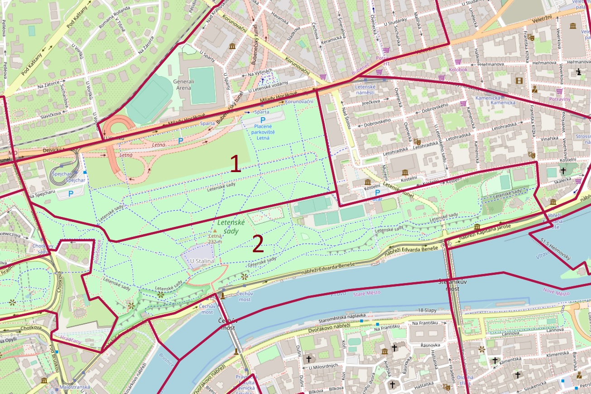

## Scraper na data z O2 Liberty API

_S velkou silou přichází velká zodpovědnost._ (Spidermanův strejda)

**ZKONTROLUJTE DATUM, PRO KTERÉ API VRÁTILO DATA (NEJSPÍŠ BUDOU STARÁ)**

Skript stáhne z [O2 Liberty API](https://www.o2.cz/podnikatel/liberty-api/) sociodemo data o návštěvnosti Letné mezi 15 a 19 hodinou. Data jsou dělená na dvě ZSJ: _Škvára_ (plac podél Milady až ke Kachlíku) je v mapce č. 1, _Stalin_, tedy Letenské sady, č. 2.

_© Přispěvatelé [OpenStreetMap](https://www.openstreetmap.org)_

Login do nastavení API klíče je v pwd manageru.

Skript zároveň vytáhne, kolik se ten den přepravilo lidí z Brna-středu na Prahu 7.

Uživatele nutno varovat, že čísla jsou extrapolace z dat o kliuentech O2, nemusí to tak bejt přesný.